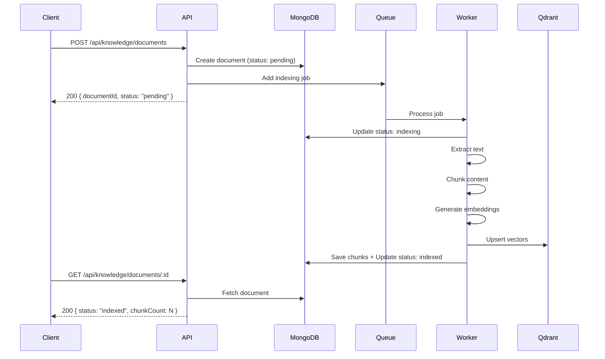
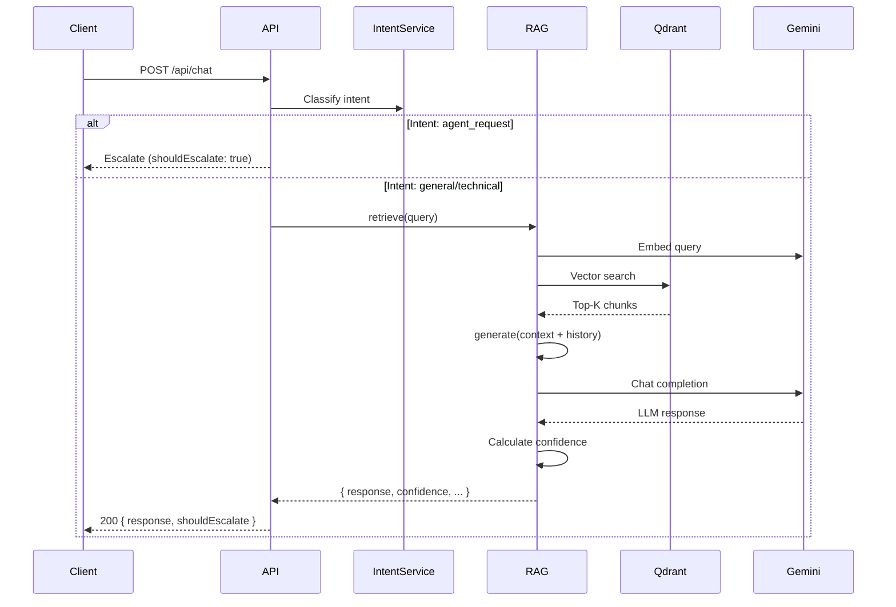

# API Documentation - LiveChat AI Backend

## 📋 Base URL

```
http://localhost:3310  # Development
https://your-domain.com  # Production
```

---

## 🔐 Authentication

Tất cả API endpoints (trừ health check) yêu cầu API Key authentication.

**Header yêu cầu:**
```http
Authorization: Bearer YOUR_API_KEY
```

**Lấy API Key**: Cấu hình trong file `.env` với key `API_KEY`

---

## 📡 API Endpoints

### 1. Health Check

Kiểm tra trạng thái hệ thống và các dịch vụ phụ thuộc.

```http
GET /api/health
```

**Authentication**: Không yêu cầu

**Response:**
```json
{
  "status": "ok",
  "qdrant": "connected",
  "gemini": "available",
  "timestamp": "2026-02-15T13:30:00.000Z"
}
```

**Response Fields:**
- `status`: `ok` | `degraded` - Trạng thái tổng thể
- `qdrant`: `connected` | `disconnected` - Kết nối Qdrant Vector DB
- `gemini`: `available` | `unavailable` - Gemini API availability
- `timestamp`: ISO 8601 timestamp

---

## 💬 Chat API

### POST /api/chat

Gửi tin nhắn từ visitor và nhận phản hồi từ AI Agent.

**Authentication**: Required

**Request Body:**
```json
{
  "message": "Làm sao để đăng ký tài khoản?",
  "tenantSlug": "my-company",
  "conversationId": "conv-unique-id",
  "conversationHistory": [
    {
      "role": "visitor",
      "content": "Chào bạn"
    },
    {
      "role": "assistant",
      "content": "Xin chào! Tôi có thể giúp gì cho bạn?"
    }
  ],
  "metadata": {
    "customerId": "cust-123",
    "sessionId": "sess-456"
  }
}
```

**Request Schema:**
| Field | Type | Required | Description |
|-------|------|----------|-------------|
| `message` | string | ✅ | Tin nhắn từ visitor |
| `tenantSlug` | string | ✅ | ID của tenant/khách hàng |
| `conversationId` | string | ✅ | ID hội thoại để tracking |
| `conversationHistory` | array | ❌ | Lịch sử hội thoại (max 10 messages) |
| `metadata` | object | ❌ | Metadata bổ sung |

**Conversation History Item:**
```typescript
{
  role: "visitor" | "assistant",
  content: string
}
```

**Response:**
```json
{
  "response": "Để đăng ký tài khoản, bạn truy cập mục 'Đăng ký' trên trang chủ và điền thông tin...",
  "confidence": 0.87,
  "intent": "account_registration",
  "shouldEscalate": false,
  "escalationReason": null,
  "retrievedChunks": [
    {
      "content": "Hướng dẫn đăng ký tài khoản...",
      "score": 0.92,
      "metadata": {
        "documentTitle": "Hướng dẫn sử dụng",
        "category": "tutorial"
      }
    }
  ],
  "tokenUsage": 245,
  "processingTime": 1850
}
```

**Response Fields:**
| Field | Type | Description |
|-------|------|-------------|
| `response` | string | Câu trả lời từ AI |
| `confidence` | number | Độ tin cậy (0-1). < 0.5 → nên escalate |
| `intent` | string | Intent category: `general`, `agent_request`, `technical`, etc. |
| `shouldEscalate` | boolean | `true` nếu cần chuyển cho nhân viên |
| `escalationReason` | string \| null | Lý do escalate: `low_confidence`, `explicit_request`, `ai_rate_limited` |
| `retrievedChunks` | array | Các chunks kiến thức được truy vấn |
| `tokenUsage` | number | Số token LLM đã sử dụng |
| `processingTime` | number | Thời gian xử lý (ms) |

**Error Handling:**

- **429 Rate Limit / Quota Exceeded**: Trả về response với `shouldEscalate: true` và `escalationReason: "ai_rate_limited"` thay vì error
- **503 Service Unavailable**: Lỗi xử lý nghiêm trọng

**Example Error Response:**
```json
{
  "statusCode": 503,
  "message": "Lỗi xử lý tin nhắn AI",
  "error": "Connection timeout"
}
```

---

## 📚 Knowledge Management API

### POST /api/knowledge/documents

Upload tài liệu mới vào knowledge base.

**Authentication**: Required

**Content-Type**: `multipart/form-data`

**Request Body (Form Data):**
| Field | Type | Required | Description |
|-------|------|----------|-------------|
| `file` | File | ❌* | File binary (PDF, DOCX, TXT) |
| `tenantSlug` | string | ✅ | ID của tenant |
| `title` | string | ✅ | Tiêu đề tài liệu |
| `category` | string | ✅ | Phân loại: `faq`, `tutorial`, `policy`, etc. |
| `content` | string | ❌* | Text content (nếu không upload file) |

*Phải có ít nhất `file` hoặc `content`

**File Requirements:**
- **Allowed types**: `.pdf`, `.docx`, `.txt`
- **Max size**: 10MB

**Response:**
```json
{
  "documentId": "65abc123def456789",
  "status": "pending",
  "message": "Tài liệu đang được xử lý..."
}
```

**Response Fields:**
| Field | Type | Description |
|-------|------|-------------|
| `documentId` | string | MongoDB ObjectId của document |
| `status` | string | `pending` - Initial status |
| `message` | string | Status message |

**Processing Flow:**
1. Document được tạo với status `pending`
2. Background job (BullMQ) xử lý indexing
3. Status chuyển thành `indexing` → `indexed` hoặc `failed`
4. Client có thể poll status qua `GET /api/knowledge/documents/:id`

---

### GET /api/knowledge/documents

Lấy danh sách tài liệu.

**Authentication**: Required

**Query Parameters:**
| Parameter | Type | Required | Description |
|-----------|------|----------|-------------|
| `tenantSlug` | string | ❌ | Filter theo tenant |
| `status` | string | ❌ | Filter: `pending`, `indexing`, `indexed`, `failed` |
| `category` | string | ❌ | Filter theo category |

**Example Request:**
```http
GET /api/knowledge/documents?tenantSlug=my-company&status=indexed&category=faq
```

**Response:**
```json
{
  "documents": [
    {
      "id": "65abc123def456789",
      "title": "Câu hỏi thường gặp",
      "category": "faq",
      "status": "indexed",
      "chunkCount": 45,
      "createdAt": "2026-02-15T10:00:00.000Z",
      "indexedAt": "2026-02-15T10:02:35.000Z",
      "errorMessage": null,
      "metadata": {}
    }
  ],
  "total": 1
}
```

**Document Object:**
| Field | Type | Description |
|-------|------|-------------|
| `id` | string | Document ID |
| `title` | string | Tiêu đề |
| `category` | string | Phân loại |
| `status` | string | `pending` \| `indexing` \| `indexed` \| `failed` |
| `chunkCount` | number | Số chunks đã tạo |
| `createdAt` | string | ISO timestamp |
| `indexedAt` | string \| null | Thời gian hoàn tất indexing |
| `errorMessage` | string \| null | Error message nếu failed |

---

### GET /api/knowledge/documents/:id

Lấy chi tiết một tài liệu.

**Authentication**: Required

**Path Parameters:**
- `id` - Document ID (MongoDB ObjectId)

**Response:**
```json
{
  "id": "65abc123def456789",
  "title": "Hướng dẫn sử dụng",
  "category": "tutorial",
  "status": "indexed",
  "chunkCount": 120,
  "createdAt": "2026-02-15T10:00:00.000Z",
  "indexedAt": "2026-02-15T10:05:12.000Z",
  "errorMessage": null,
  "metadata": {},
  "fileType": "pdf"
}
```

**Additional Fields:**
| Field | Type | Description |
|-------|------|-------------|
| `fileType` | string | `pdf`, `docx`, `txt`, `text` |

---

### DELETE /api/knowledge/documents/:id

Xóa tài liệu và tất cả chunks liên quan.

**Authentication**: Required

**Path Parameters:**
- `id` - Document ID

**Response:**
```json
{
  "success": true,
  "message": "Đã xóa tài liệu"
}
```

**Side Effects:**
- Xóa document metadata từ MongoDB
- Xóa tất cả chunks từ MongoDB
- Xóa tất cả vectors từ Qdrant

---

### POST /api/knowledge/reindex/:id

Reindex lại tài liệu (xóa chunks cũ và tạo mới).

**Authentication**: Required

**Path Parameters:**
- `id` - Document ID

**Response:**
```json
{
  "success": true,
  "message": "Đang reindex..."
}
```

**Use Cases:**
- Update chunking strategy
- Fix corrupted embeddings
- Re-extract text từ file

---

### POST /api/knowledge/search

Tìm kiếm knowledge base bằng vector similarity search.

**Authentication**: Required

**Request Body:**
```json
{
  "query": "Làm sao reset mật khẩu?",
  "tenantSlug": "my-company",
  "category": "faq",
  "topK": 5
}
```

**Request Schema:**
| Field | Type | Required | Description |
|-------|------|----------|-------------|
| `query` | string | ✅ | Câu hỏi tìm kiếm |
| `tenantSlug` | string | ✅ | Tenant slug |
| `category` | string | ❌ | Filter theo category |
| `topK` | number | ❌ | Số kết quả trả về (default: 5) |

**Response:**
```json
{
  "chunks": [
    {
      "id": "qdrant-point-uuid",
      "score": 0.89,
      "content": "Để reset mật khẩu, truy cập trang 'Quên mật khẩu'...",
      "metadata": {
        "tenantSlug": "my-company",
        "documentId": "65abc123def456789",
        "category": "faq",
        "documentTitle": "FAQ - Tài khoản",
        "chunkIndex": 12,
        "chunkType": "paragraph"
      }
    }
  ],
  "maxScore": 0.89,
  "total": 5
}
```

**Chunk Object:**
| Field | Type | Description |
|-------|------|-------------|
| `id` | string | Qdrant point ID |
| `score` | number | Cosine similarity score (0-1) |
| `content` | string | Nội dung chunk |
| `metadata` | object | Metadata từ Qdrant payload |

---

## 🔄 Processing Pipeline

### Document Indexing Flow



### Chat Processing Flow



---

## 📊 Status Codes

| Code | Description |
|------|-------------|
| `200` | Success |
| `400` | Bad Request - Invalid parameters |
| `401` | Unauthorized - Missing/invalid API key |
| `404` | Not Found - Resource không tồn tại |
| `413` | Payload Too Large - File > 10MB |
| `415` | Unsupported Media Type - File type không hỗ trợ |
| `503` | Service Unavailable - AI service error |

---

## 🧪 Testing Examples

### cURL Examples

#### 1. Health Check
```bash
curl http://localhost:3310/api/health
```

#### 2. Chat
```bash
curl -X POST http://localhost:3310/api/chat \
  -H "Authorization: Bearer YOUR_API_KEY" \
  -H "Content-Type: application/json" \
  -d '{
    "message": "Làm sao để đăng ký?",
    "tenantSlug": "demo",
    "conversationId": "test-123"
  }'
```

#### 3. Upload Document (File)
```bash
curl -X POST http://localhost:3310/api/knowledge/documents \
  -H "Authorization: Bearer YOUR_API_KEY" \
  -F "file=@document.pdf" \
  -F "tenantSlug=demo" \
  -F "title=User Guide" \
  -F "category=tutorial"
```

#### 4. Upload Document (Text)
```bash
curl -X POST http://localhost:3310/api/knowledge/documents \
  -H "Authorization: Bearer YOUR_API_KEY" \
  -F "tenantSlug=demo" \
  -F "title=Quick FAQ" \
  -F "category=faq" \
  -F "content=Q: How to login? A: Use your email and password..."
```

#### 5. Search Knowledge
```bash
curl -X POST http://localhost:3310/api/knowledge/search \
  -H "Authorization: Bearer YOUR_API_KEY" \
  -H "Content-Type: application/json" \
  -d '{
    "query": "reset password",
    "tenantSlug": "demo",
    "topK": 3
  }'
```

#### 6. List Documents
```bash
curl "http://localhost:3310/api/knowledge/documents?tenantSlug=demo&status=indexed" \
  -H "Authorization: Bearer YOUR_API_KEY"
```

---

## 📝 Best Practices

### 1. **Multi-tenancy**
- Luôn gửi đúng `tenantSlug` để đảm bảo data isolation
- Mỗi tenant có knowledge base riêng biệt

### 2. **Conversation History**
- Gửi max 10 messages gần nhất để tránh token overflow
- Format: `[{role: "visitor"|"assistant", content: "..."}]`

### 3. **Confidence Threshold**
- Recommend: escalate khi `confidence < 0.5`
- Tuỳ chỉnh threshold dựa trên use case

### 4. **Document Categories**
- Sử dụng categories nhất quán để filter hiệu quả
- Ví dụ: `faq`, `tutorial`, `policy`, `product`, `technical`

### 5. **Error Handling**
- Chat API: Luôn xử lý `shouldEscalate: true` để chuyển cho agent
- Rate limits: Được handle gracefully với fallback response

### 6. **File Upload**
- Validate file type và size trước khi upload
- Poll status endpoint để biết khi nào indexing hoàn tất

---

## 🔗 Related Documentation

- [RAG Pipeline Overview](./RAG_PIPELINE.md) - Chi tiết về kiến trúc RAG
- [README](./README.md) - Setup và deployment guide
- Environment Configuration - `.env` variables

---

## 📞 Support

Để được hỗ trợ về API, vui lòng liên hệ team development hoặc tạo issue trong repository.
