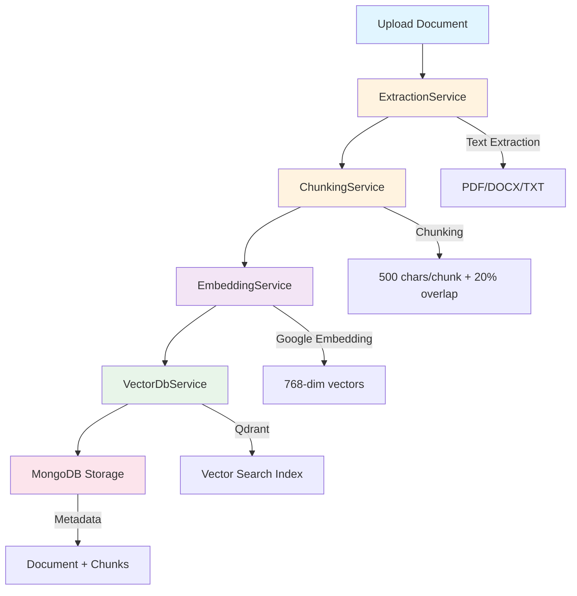
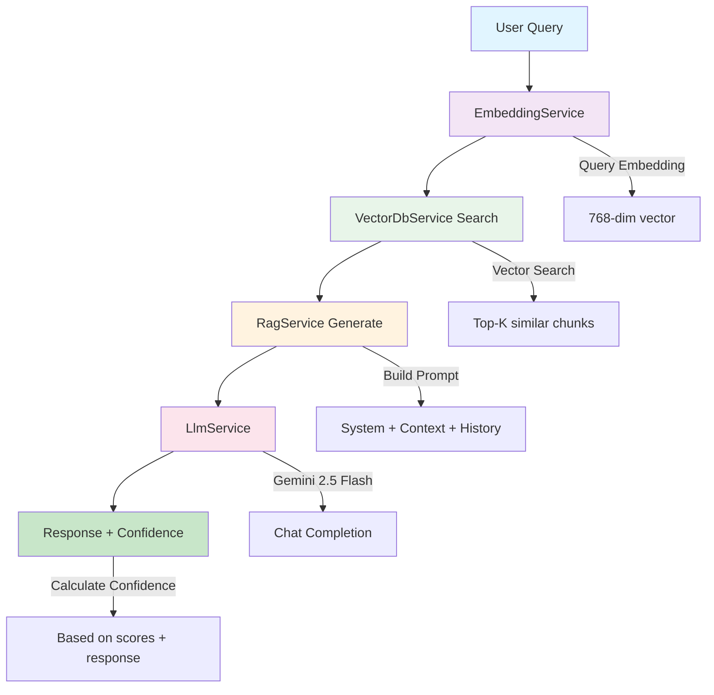

# RAG Pipeline Overview - LiveChat AI

## 📋 Tổng Quan

Pipeline RAG (Retrieval-Augmented Generation) của dự án **livechat-ai-be** được chia thành 2 giai đoạn chính:

1. **INGEST Pipeline** - Nhập và xử lý kiến thức
2. **QUERY Pipeline** - Truy vấn và sinh câu trả lời

---

## 🔄 INGEST PIPELINE (Indexing Knowledge)

Pipeline này xử lý việc nhập tài liệu vào hệ thống và biến chúng thành vectors có thể tìm kiếm.

### 📊 Flow Chart



### 🧩 Components chi tiết

#### 1. **ExtractionService** 
📍 Path: [`src/knowledge/extraction.service.ts`](src/knowledge/extraction.service.ts)

**Nhiệm vụ**: Trích xuất text từ các file upload (PDF, DOCX, TXT)

**Công nghệ**: 
- `pdf-parse` cho PDF
- `mammoth` cho DOCX  
- `fs` cho TXT

**Input**: File path + file type  
**Output**: Raw text content

---

#### 2. **ChunkingService**
📍 Path: [`src/knowledge/chunking.service.ts`](src/knowledge/chunking.service.ts)

**Nhiệm vụ**: Chia text thành các đoạn nhỏ (chunks) để embedding

**Chiến lược**:
- **Chunk size**: 500 ký tự mỗi chunk
- **Overlap**: 20% (100 ký tự) để giữ ngữ cảnh
- **Natural breaks**: Ưu tiên cắt tại cuối đoạn văn, cuối câu, khoảng trắng

**Phát hiện chunk type**: 
- `title` - tiêu đề
- `list` - danh sách
- `code` - code block
- `paragraph` - đoạn văn thông thường

**Input**: Raw text  
**Output**: Array of `ChunkResult[]` 
```typescript
{
  content: string,
  chunkIndex: number,
  chunkType: string
}
```

---

#### 3. **EmbeddingService**
📍 Path: [`src/rag/embedding.service.ts`](src/rag/embedding.service.ts)

**Nhiệm vụ**: Chuyển đổi text chunks thành vector embeddings

**Model**: Google `text-embedding-004`  
**Dimension**: 768 chiều

**Tối ưu**:
- Batch processing: 100 chunks/batch
- Sử dụng `batchEmbedContents` API của Gemini

**Methods**:
- `embed(text)` - Embedding đơn lẻ
- `embedBatch(texts[])` - Embedding hàng loạt (memory efficient)

**Input**: Text string hoặc text array  
**Output**: `number[]` hoặc `number[][]` (vector embeddings)

---

#### 4. **VectorDbService**
📍 Path: [`src/rag/vector-db.service.ts`](src/rag/vector-db.service.ts)

**Nhiệm vụ**: Lưu trữ và quản lý vector embeddings trong Qdrant

**Database**: Qdrant Vector Database  
**Distance metric**: Cosine similarity

**Collection Schema**:
```typescript
{
  vectors: {
    size: 768,
    distance: 'Cosine'
  }
}
```

**Payload Schema**:
```typescript
{
  tenantSlug: string,
  documentId: string,
  category: string,
  documentTitle: string,
  content: string,
  chunkIndex: number
}
```

**Methods**:
- `upsertPoints()` - Thêm/cập nhật vectors
- `search()` - Tìm kiếm vectors tương tự
- `deleteByDocumentId()` - Xóa vectors theo document

---

#### 5. **KnowledgeIndexingProcessor**
📍 Path: [`src/queue/processors/knowledge-indexing.processor.ts`](src/queue/processors/knowledge-indexing.processor.ts)

**Nhiệm vụ**: Orchestrator điều phối toàn bộ INGEST pipeline

**Queue**: BullMQ (Redis-backed)  
**Processing**: Batch streaming (15 chunks at a time)

**Pipeline Steps**:
1. Fetch document từ MongoDB
2. Extract text (nếu chưa có)
3. Chunk content
4. Process theo batch:
   - Embed batch chunks
   - Prepare Qdrant points
   - Upsert to Qdrant
   - Save chunk metadata to MongoDB
5. Update document status → `indexed`

**Memory Optimization**: 
- O(batch_size) thay vì O(total_chunks)
- Streaming pipeline giúp xử lý tài liệu lớn mà không tràn bộ nhớ

**Status tracking**:
- `pending` → `indexing` → `indexed` / `failed`
- Progress update qua BullMQ job progress

---

## 🔍 QUERY PIPELINE (Retrieval & Generation)

Pipeline này xử lý câu hỏi từ người dùng và sinh câu trả lời thông minh.

### 📊 Flow Chart



### 🧩 Components chi tiết

#### 1. **RagService.retrieve()**
📍 Path: [`src/rag/rag.service.ts`](src/rag/rag.service.ts)

**Nhiệm vụ**: Tìm kiến thức liên quan từ vector database

**Process**:
1. Embed câu hỏi thành vector (via `EmbeddingService`)
2. Search trong Qdrant với filters:
   - `tenantSlug` (bắt buộc)
   - `category` (optional)
3. Trả về top-K chunks (mặc định K=5)

**Input**:
```typescript
{
  query: string,
  tenantSlug: string,
  category?: string,
  topK?: number
}
```

**Output**:
```typescript
{
  chunks: SearchResult[],
  maxScore: number
}
```

---

#### 2. **RagService.generate()**
📍 Path: [`src/rag/rag.service.ts`](src/rag/rag.service.ts)

**Nhiệm vụ**: Tạo câu trả lời dựa trên context và lịch sử hội thoại

**Process**:
1. Build system prompt (theo config: professional/friendly)
2. Build user prompt với context chunks
3. Kết hợp conversation history (max 10 messages gần nhất)
4. Gọi LLM (Gemini 2.5 Flash)
5. Tính confidence score

**Confidence Calculation**:
- Base: Average score của top-3 chunks
- Penalty: Nếu phát hiện "uncertainty phrases" → confidence *= 0.5
- Uncertainty phrases: "không có đủ thông tin", "không biết", "không chắc", "nhân viên hỗ trợ"

**Input**:
```typescript
{
  query: string,
  context: SearchResult[],
  conversationHistory: Array<{role, content}>,
  config: {
    responseStyle: string,
    maxResponseLength: number,
    language: string,
    aiDisplayName: string
  }
}
```

**Output**:
```typescript
{
  response: string,
  confidence: number,  // 0-1
  tokenUsage: number,
  processingTime: number  // ms
}
```

---

#### 3. **LlmService**
📍 Path: [`src/rag/llm.service.ts`](src/rag/llm.service.ts)

**Nhiệm vụ**: Giao tiếp với Gemini LLM API

**Model**: `gemini-2.0-flash-exp` (configurable)

**Features**:
- Multi-turn conversation support
- System prompt customization
- Temperature control (mặc định 0.3 cho RAG)
- Token usage tracking

**Method**: `chat()`
```typescript
{
  systemPrompt: string,
  messages: Array<{role: 'user'|'assistant', content: string}>,
  temperature?: number,
  maxTokens?: number
}
```

---

## 📁 File Structure Summary

```
livechat-ai-be/src/
├── rag/                          # 🔍 QUERY Pipeline Core
│   ├── embedding.service.ts      # Embedding (cả Ingest & Query)
│   ├── vector-db.service.ts      # Vector DB (cả Ingest & Query) 
│   ├── llm.service.ts            # LLM Generation
│   └── rag.service.ts            # RAG Orchestrator (retrieve + generate)
│
├── knowledge/                    # 📥 INGEST Pipeline
│   ├── extraction.service.ts    # Text extraction
│   ├── chunking.service.ts      # Text chunking
│   └── schemas/
│       ├── document.schema.ts   # Document metadata
│       └── chunk.schema.ts      # Chunk metadata
│
└── queue/                        # ⚙️ Background Processing
    └── processors/
        └── knowledge-indexing.processor.ts  # INGEST orchestrator
```

---

## 🎯 Key Design Patterns

### Multi-Tenancy
- Mọi thao tác đều filter theo `tenantSlug`
- Isolation hoàn toàn giữa các tenant trong cùng 1 Qdrant collection

### Async Processing
- Upload tài liệu trả về ngay (status: `pending`)
- Background job xử lý indexing
- Client poll status qua API

### Memory Efficiency
- Batch streaming processing (15 chunks/batch)
- Không load toàn bộ chunks vào memory
- Tránh OOM với tài liệu lớn

### Confidence-based Escalation
- Confidence < threshold → escalate to human agent
- Tự động phát hiện câu trả lời không chắc chắn

---

## 🔗 Integration Points

### Chat Flow
📍 [`src/chat/chat.service.ts`](src/chat/chat.service.ts)

```typescript
const retrievalResult = await ragService.retrieve({...});
const ragResult = await ragService.generate({...});

if (ragResult.confidence < config.confidenceThreshold) {
  // Escalate to human agent
}
```

### Knowledge Management
📍 [`src/knowledge/knowledge.controller.ts`](src/knowledge/knowledge.controller.ts)

```typescript
// Upload document → push to queue
await queue.add('index-document', {...});

// Query knowledge
await ragService.retrieve({...});
```

---

## ✅ Kết Luận

Pipeline RAG hiện tại đã được tổ chức tương đối rõ ràng theo 2 giai đoạn:

### ✅ INGEST (Indexing)
1. Extraction → 2. Chunking → 3. Embedding → 4. Vector Storage → 5. Metadata Storage

### ✅ QUERY (Retrieval + Generation)  
1. Query Embedding → 2. Vector Search → 3. LLM Generation → 4. Confidence Scoring

Tuy nhiên, có thể cải thiện thêm về:
- **Documentation**: Thêm comments và architectural decision records (ADRs)
- **Monitoring**: Metrics cho từng bước trong pipeline
- **Error handling**: Retry logic và fallback strategies
