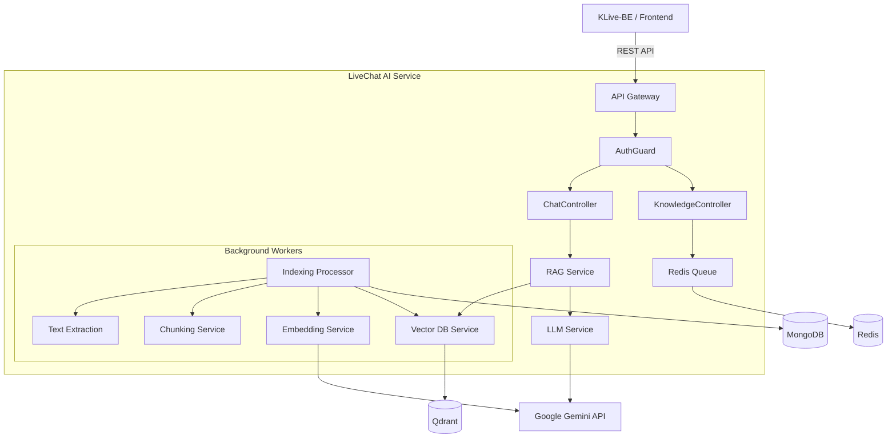

# LiveChat AI Backend (`livechat-ai-be`)

**LiveChat AI Backend** là service AI Agent thông minh được thiết kế cho hệ thống LiveChat, cung cấp khả năng trả lời tự động khách hàng thông qua pipeline RAG (Retrieval-Augmented Generation) hiện đại.

Hệ thống sử dụng **Google Gemini** làm LLM engine, kết hợp với **Qdrant Vector Database** và cơ chế xử lý background job mạnh mẽ với **BullMQ** để quản lý knowledge base quy mô lớn.

---

## 🚀 Tính Năng Nổi Bật

- **RAG Pipeline Thông Minh**: Tự động tìm kiếm thông tin liên quan từ knowledge base để trả lời câu hỏi khách hàng với độ chính xác cao.
- **Asynchronous Indexing**: Hệ thống indexing non-blocking sử dụng BullMQ & Redis, hỗ trợ xử lý tài liệu lớn (PDF, DOCX) mà không ảnh hưởng hiệu năng.
- **Vector Search**: Tích hợp Qdrant cho khả năng tìm kiếm ngữ nghĩa (semantic search) vượt trội.
- **Multi-Tenant Support**: Thiết kế hỗ trợ nhiều tenant (website/khách hàng) trên cùng một instance.
- **Scalable Architecture**: Kiến trúc microservices-ready, dễ dàng scale worker nodes.

## 🛠️ Tech Stack

| Component | Technology | Description |
|-----------|-----------|-------------|
| **Core Framework** | NestJS (v11) | TypeScript Node.js framework |
| **LLM Engine** | Google Gemini 2.5 Flash | High-performance LLM |
| **Embedding** | Gemini Embedding 001 | 3072-dimension vectors |
| **Vector DB** | Qdrant | Semantic search engine |
| **Queue System** | BullMQ & Redis | Background job processing |
| **Primary DB** | MongoDB | Metadata & Document storage |
| **Documentation** | Swagger / OpenAPI | API standards |

## 🏗️ Kiến Trúc Hệ Thống



## 📦 Cài Đặt & Triển Khai

### Yêu Cầu Tiên Quyết

- **Node.js**: v20+
- **Docker & Docker Compose**: (Bắt buộc cho production)
- **pnpm**: Package manager (`npm install -g pnpm`)

### 1. Thiết Lập Môi Trường

Sao chép file cấu hình mẫu và cập nhật các biến môi trường:

```bash
cp .env.example .env
```

Cập nhật các giá trị quan trọng trong `.env`:
- `GEMINI_API_KEY`: API Key từ Google AI Studio.
- `API_KEY`: Secret key để xác thực với KLive-BE.

### 2. Khởi Chạy Infrastructure

Sử dụng Docker Compose để chạy các dịch vụ phụ trợ (MongoDB, Qdrant, Redis):

```bash
docker-compose up -d mongo qdrant redis
```

### 3. Chạy Ứng Dụng (Development)

```bash
# Cài đặt dependencies
pnpm install

# Build project
pnpm build

# Chạy development server
pnpm start:dev
```
Server sẽ khởi chạy tại: `http://localhost:3310`

### 4. Triển Khai Production (Docker)

Để chạy toàn bộ hệ thống bao gồm cả ứng dụng bằng Docker:

```bash
docker-compose up -d --build
```

## 📚 API Documentation

Để xem chi tiết đầy đủ về API endpoints, request/response schemas, examples, và best practices, vui lòng tham khảo:

📖 **[API Documentation](./API_DOCS.md)**

### Quick Reference

**Base URL**: `http://localhost:3310/api`

**Authentication**: Tất cả endpoints (trừ health check) yêu cầu API Key header:
```
Authorization: Bearer YOUR_API_KEY
```

**Main Endpoints**:
- `GET /health` - Health check
- `POST /chat` - AI chat processing
- `POST /knowledge/documents` - Upload knowledge documents
- `GET /knowledge/documents` - List documents
- `POST /knowledge/search` - Vector similarity search

Xem [API_DOCS.md](./API_DOCS.md) để biết chi tiết về từng endpoint.


## 🧪 Testing

```bash
# Unit tests
pnpm test

# E2E tests
pnpm test:e2e
```

## 📂 Project Structure

```
src/
├── chat/           # Xử lý hội thoại & RAG pipeline
├── knowledge/      # Quản lý tài liệu & Indexing logic
├── queue/          # BullMQ Processors (Background Jobs)
├── rag/            # Tương tác với LLM & Vector DB
├── common/         # Utilities & Shared Guards
└── config/         # Environment Configuration
```

## 📄 License

Private - Internal Distribution Only.
